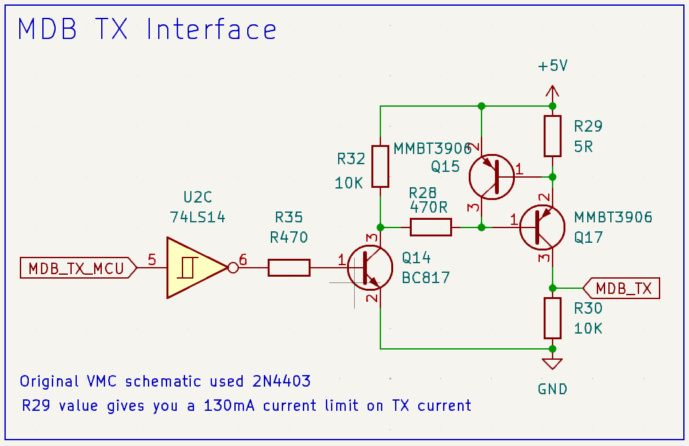
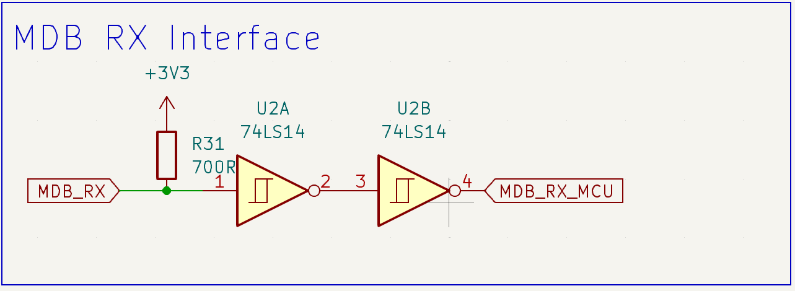

# Hardware Info

## Connectors

The specification defines the connector, its' pinout and the voltages used.  These are:

1.  24V DC (power)
1.  GND (power)
1.  Not connected
1.  VMC TX
1.  VMC RX
1.  GND (signal)

The power supply voltage is defined in the spec as :

Min: 20VDC
Nom: 24VDC rms (rectified), 34VDC unregulated (rectified + filtered)
Max: 42.5VDC (ripple voltage upper limit)

The connectors specified are Molex:

VMC:
* [Harness/Inline - Molex 39-01-2061](https://www.digikey.co.uk/en/products/detail/molex/0039012061/61240)
* [Vertical - Molex 39-28-1063](https://www.digikey.co.uk/en/products/detail/molex/0039281063/61404)
* [90 degree - Molex 39-30-1060](https://www.digikey.com/en/products/detail/molex/0039301060/561080)

Peripherals:  [Molex 39-01-2060](https://www.digikey.co.uk/en/products/detail/molex/0039012060/61379)

The idea is that the power and signal grounds **may** be different if wished. 

## Interface schematics - VMC

The VMC is not optoisolated from the bus - the optoisolation is provided at each peripheral. 

### VMC Transmit interface 

This suggested/tested interface uses a pair of PNP transistors to provide a constant current driver, to protect the output against short/overcurrents.  This circuit is designed to be driven from a 3v3 logic input, hence the 74LS14 inverting buffer and extra NPN transistor.   

If driving directly from 5V, then these can be omitted.

### VMC Receive Interface

For driving from 3v3, the following schematic has been tested and found to work: (NB Two more inverting buffers from the same 74LS14 are used here).  NB the pullup used is to 3v3 rather than 5v, but as the peripherals merely pull this down to ground with optoisolators, it works as expected.

## Interface schematics - peripherals

Peripherals are required to have optoisolators on both the VMC TX/RX lines. Schematics to follow.

